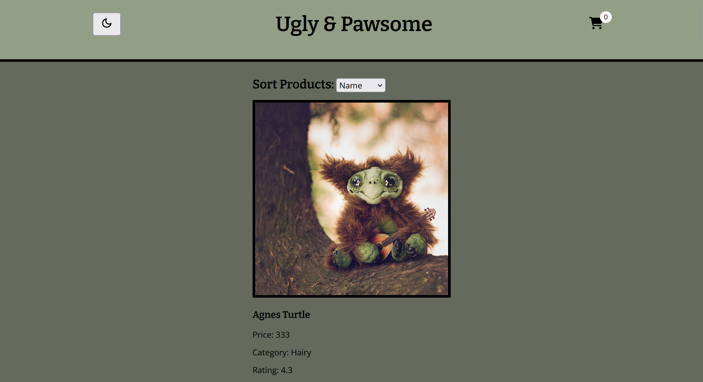
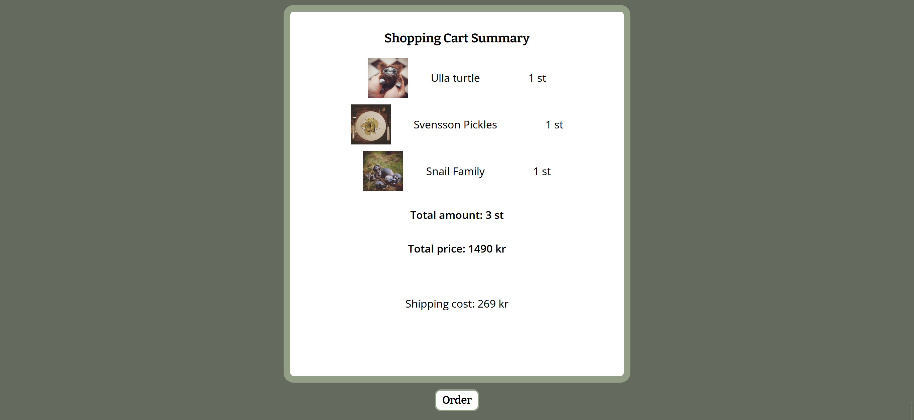
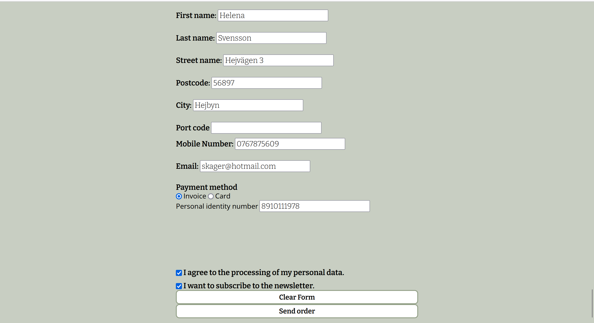
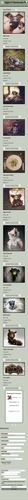
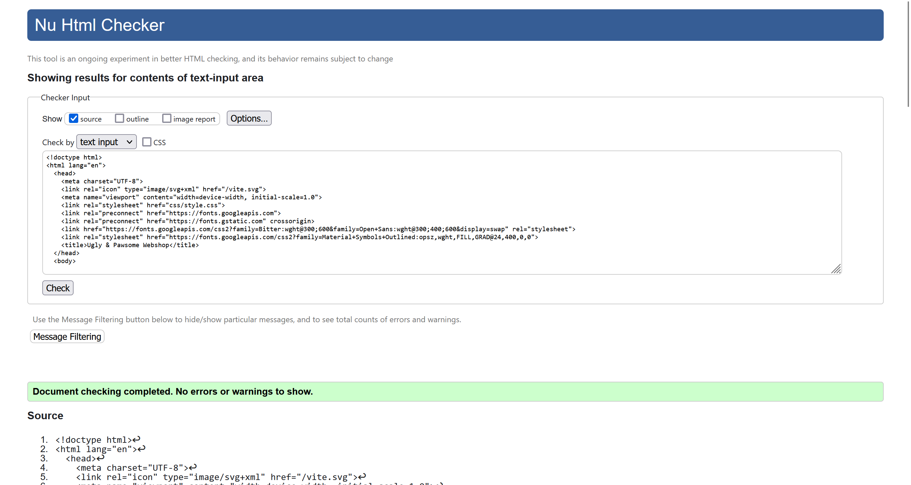
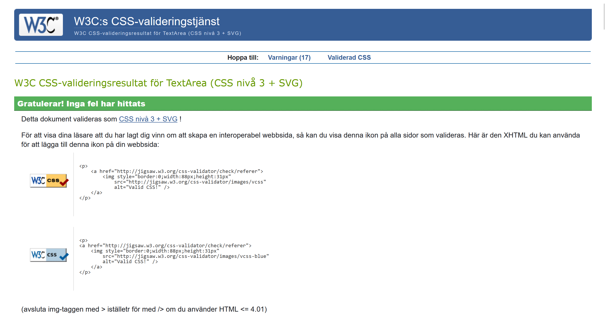
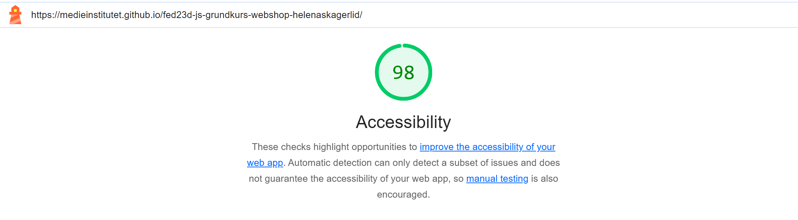

# Monster Webshop

## About 

This webshop was a individual project we did in our Introduction Course in Javascript (JS). The assigment was to learn the basics in JS by creating a webshop from an imagined client. The client had specific requierments that we were expected to deliver to them. Over the course of 4 weeks I created this webshop.

## Link to the project

https://medieinstitutet.github.io/fed23d-js-grundkurs-webshop-helenaskagerlid/

## Learning Focus

The areas we got examinated on:

- Logic & Program Flow
- Comments and Self-Documenting Code
- High Code Quality, Conventions
- Conditionals (if statements)
- Events
- DOM Manipulation
- Functions
- Variables
- Arithmetic
- Objects
- Arrays
- Timers
- Loops
- Dates

## The team

Helena Skagerlid - https://github.com/helenaskagerlid

## Tech Stack

- HTML
- Sass
- Javascript
- Vite

## Screenshots of the project

The webshop in desktop, first page

The webshop in desktop dark mode

The cart summary desktop

The order form desktop

All of the mobile version

## Validation

Validation of my HTML-code

Validation of my CSS-code

A Lighthouse report accessiility on my project

